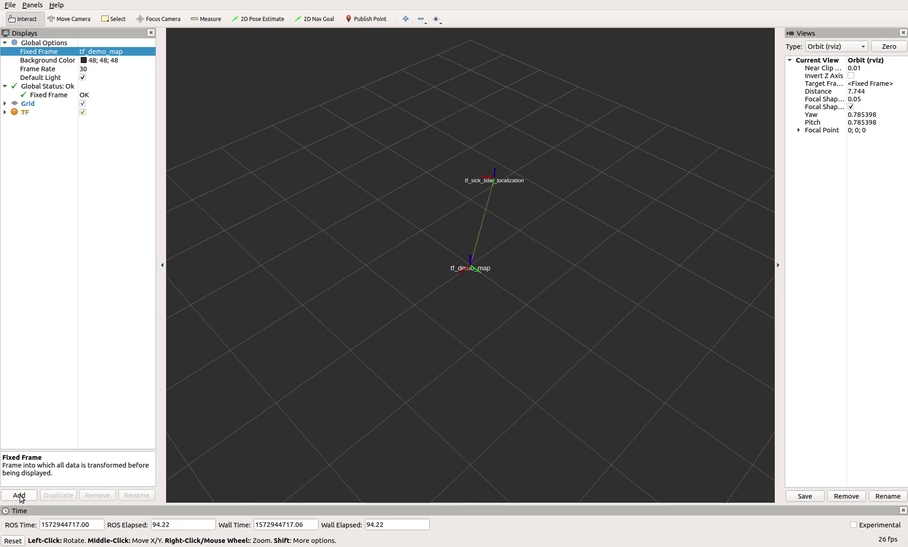
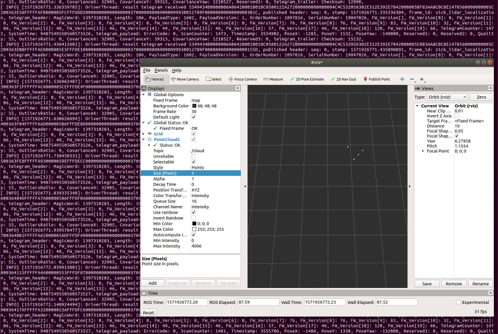

# sick_lidar_localization

sick_lidar_localization is an open-source project to support the LiDAR-LOC software of the company SICK 
using the ROS-framework

## Install and build

To install and build ROS support for SICK LiDAR Localization, run the following commands:

```console
cd ~/catkin_ws/src
# sudo apt-get install expect                                      # install unbuffer for logging console output, development only
# git clone https://github.com/madler/crcany.git                   # get crc implementation, development only
# git clone https://github.com/michael1309/sick_lidar_localization_pretest.git # sick_lidar_localization development
git clone https://github.com/SICKAG/sick_lidar_localization.git    # sick_lidar_localization release version
cd ..
source /opt/ros/melodic/setup.bash
catkin_make
catkin_make install
source ./devel/setup.bash
```

## Run

To run SICK LiDAR Localization under ROS, install the SICK localization controller and run the ros driver:

1. Install and run the SICK localization controller. See [doc/Quickstart-Setup-SOPASair.md](doc/Quickstart-Setup-SOPASair.md)
for a quickstart. Find detailed information in the operation manuals published on 
https://supportportal.sick.com/Product_notes/lidar-loc-operation-instruction/.

2. Start the sick_lidar_localization driver:

```console
cd ~/catkin_ws
source ./devel/setup.bash
roslaunch sick_lidar_localization sim_loc_driver.launch localization_controller_ip_address:=192.168.0.1
```

Note: The IP address of the SICK localization controller is 192.168.0.1 by default. Depending on your network configuration,
different IP addresses can be configured by commandline argument `localization_controller_ip_address:=<ip-address>` or 
by changing the value `localization_controller_default_ip_address: "<ip-address>"` in the drivers configuration file 
[yaml/sim_loc_driver.yaml](yaml/sim_loc_driver.yaml).

The sick_lidar_localization driver connects to the localization controller, receives result port telegrams and publishes
them on ros topic "/sick_lidar_localization/driver/result_telegrams". After successful installation, you can view the telegram
messages with

```console
rostopic echo "/sick_lidar_localization/driver/result_telegrams"
```

## Result port telegrams

Result port telegrams are continously received and published to inform about a vehicles pose (position and orientation).
ROS result telegram messages have the datatype [msg/SickLocResultPortTelegramMsg.msg](msg/SickLocResultPortTelegramMsg.msg),
containing 4 sub-elements:

Type | Definition | Name | Description
--- | --- | --- | ---
Header | http://docs.ros.org/melodic/api/std_msgs/html/msg/Header.html | header | ROS Header with sequence id, timestamp and frame id
SickLocResultPortHeaderMsg | [msg/SickLocResultPortHeaderMsg.msg](msg/SickLocResultPortHeaderMsg.msg) | telegram_header | 52 byte header of a result port telegram
SickLocResultPortPayloadMsg | [msg/SickLocResultPortPayloadMsg.msg](msg/SickLocResultPortPayloadMsg.msg) | telegram_payload | 52 byte payload of a result port telegram
SickLocResultPortCrcMsg | [msg/SickLocResultPortCrcMsg.msg](msg/SickLocResultPortCrcMsg.msg) | telegram_trailer | 2 byte CRC trailer of a result port telegram

The following table shows a complete list over all elements of the result telegram message:

Type | Name | Description
--- | --- | ---
uint32 | header.seq | ROS sequence identifier (consecutively increasing id)
time | header.stamp | ROS timestamp in seconds and nanoseconds
string | header.frame_id | ROS frame identifier
uint32 | telegram_header.MagicWord | Magic word SICK (0x53 0x49 0x43 0x4B)
uint32 | telegram_header.Length | Length of telegram incl. header, payload, and trailer
uint16 | telegram_header.PayloadType | Payload type: 0x06c2 = Little Endian, 0x0642 = Big Endian
uint16 | telegram_header.PayloadVersion | Version of PayloadType structure
uint32 | telegram_header.OrderNumber | Order number of the localization controller
uint32 | telegram_header.SerialNumber | Serial number of the localization controller
uint8[] | telegram_header.FW_Version | Software version of the localization controller, 20 byte
uint32 | telegram_header.TelegramCounter | Telegram counter since last start-up
uint64 | telegram_header.SystemTime | Not used
uint16 | telegram_payload.ErrorCode | ErrorCode 0: OK, ErrorCode 1: UNKNOWNERROR
uint32 | telegram_payload.ScanCounter | Counter of related scan data
uint32 | telegram_payload.Timestamp | Time stamp of the pose [ms], indicating the time at which the pose is calculated
int32 | telegram_payload.PoseX | Position X of the vehicle on the map in cartesian global coordinates [mm]
int32 | telegram_payload.PoseY | Position Y of the vehicle on the map in cartesian global coordinates [mm]
int32 | telegram_payload.PoseYaw | Orientation (yaw) of the vehicle on the map [mdeg]
uint32 | telegram_payload.Reserved1 | Reserved
int32 | telegram_payload.Reserved2 | Reserved
uint8 | telegram_payload.Quality | Quality of pose [0 … 100], 1 = bad pose quality, 100 = good pose quality
uint8 | telegram_payload.OutliersRatio | Ratio of beams that cannot be assigned to the current reference map [%]
int32 | telegram_payload.CovarianceX | Covariance c1 of the pose X [mm^2]
int32 | telegram_payload.CovarianceY | Covariance c5 of the pose Y [mm^2]
int32 | telegram_payload.CovarianceYaw | Covariance c9 of the pose Yaw [mdeg^2]
uint64 | telegram_payload.Reserved3 | Reserved
uint16 | telegram_trailer.Checksum | CRC16-CCITT over length of header (52 bytes) and payload (52 bytes) without 2 bytes of the trailer
bool | vehicle_time_valid | true: vehicle_time_sec and vehicle_time_nsec valid, false: software pll still in initial phase
uint32 | vehicle_time_sec | System time of vehicles pose calculated by software pll (seconds part of the system time)
uint32 | vehicle_time_nsec | System time of vehicles pose calculated by software pll (nano seconds part of the system time)

Example output of a result telegram (ros message of type [msg/SickLocResultPortTelegramMsg.msg](msg/SickLocResultPortTelegramMsg.msg)):

```
header: 
  seq: 0
  stamp: 
    secs: 1571732539
    nsecs: 914320492
  frame_id: "sick_lidar_localization"
telegram_header: 
  MagicWord: 1397310283
  Length: 106
  PayloadType: 1602
  PayloadVersion: 1
  OrderNumber: 1097816
  SerialNumber: 19047026
  FW_Version: [0, 0, 0, 0, 0, 0, 0, 76, 76, 83, 32, 86, 48, 46, 49, 46, 57, 46, 120, 66]
  TelegramCounter: 621
  SystemTime: 9487549550560573440
telegram_payload: 
  ErrorCode: 0
  ScanCounter: 623
  Timestamp: 3468531
  PoseX: 93
  PoseY: 33
  PoseYaw: 17895
  Reserved1: 0
  Reserved2: 0
  Quality: 55
  OutliersRatio: 0
  CovarianceX: 32905
  CovarianceY: 39315
  CovarianceYaw: 1210527
  Reserved3: 0
telegram_trailer: 
  Checksum: 25105
vehicle_time_valid: True
vehicle_time_sec: 1571732539
vehicle_time_nsec: 854719042
```

Note: Result telegrams always have the same MagicWord: `1397310283` (`0x5349434B` hex resp. `SICK` in ascii/ansi) and a
length of 106 bytes (`Length: 106`).

## Time synchronization

The localization controller sends the timestamp of a pose in millisecond ticks (telegram_payload.Timestamp of a result 
port telegram). This timestamp in milliseconds is accurate, but differs from the ros system time by a time offset. 
This time offset can be queried by a LocRequestTimestamp command.

LocRequestTimestamp commands are transmitted to the localization controller by the Cola protocoll. See SICK manuals for 
a description of the Cola protocoll and SOPAS commands.

Cola commands can be transmitted to the localization controller by ros service "SickLocColaTelegram", implemented by 
sim_loc_driver and defined in file [srv/SickLocColaTelegramSrv.srv](srv/SickLocColaTelegramSrv.srv). 
Example for a Cola command to query a LocRequestTimestamp:

```
> rosservice call SickLocColaTelegram "{cola_ascii_request: 'sMN LocRequestTimestamp', wait_response_timeout: 1}"
cola_ascii_response: "sAN LocRequestTimestamp 1EDB"
send_timestamp_sec: 1573118218
send_timestamp_nsec: 365014292
receive_timestamp_sec: 1573118218
receive_timestamp_nsec: 367832063
```

`cola_ascii_response` is the response of the localization controller. `send_timestamp` and `receive_timestamp` are ros
system timestamps immediately before sending the request resp. immediately after receiving the controllers response.
Using send and receive timestamps, the time offset can be calculated:

```
delta_time_ms := mean_time_vehicle_ms - timestamp_lidar_ms
mean_time_vehicle_ms := (send_time_vehicle + receive_time_vehicle) / 2
                     := vehicles mean timestamp in milliseconds
send_time_vehicle    := vehicles timestamp when sending LocRequestTimestamp
receive_time_vehicle := vehicles timestamp when receiving the LocRequestTimestamp response
timestamp_lidar_ms   := lidar timestamp in milliseconds from LocRequestTimestamp response
```

This time offset calculation is provided by ros service "SickLocRequestTimestamp", implemented by the
sim_loc_driver and defined in file [srv/SickLocRequestTimestampSrv.srv](srv/SickLocRequestTimestampSrv.srv).
Example to query the time offset:

```
> rosservice call SickLocRequestTimestamp "{}"
timestamp_lidar_ms: 23745
mean_time_vehicle_ms: 1573118234209
delta_time_ms: 1573118210464
send_time_vehicle_sec: 1573118234
send_time_vehicle_nsec: 208421663
receive_time_vehicle_sec: 1573118234
receive_time_vehicle_nsec: 211120716
```

`delta_time_ms` gives the time offset in milliseconds. See operation manuals for details 
about time synchronization, time offset calculation and Cola telegrams.

The time offset depends on network latencies and transmission delays. To get a more accurate value, the time offset can be
calculated from N measurements by a software pll. The software pll estimates the mean time offset and calculates the 
system time from any ticks. See [doc/software_pll.md](doc/software_pll.md) for further details.

The system timestamp of a vehicle pose is calculated from lidar ticks for each result port telegram and published by 
ros message [msg/SickLocResultPortTelegramMsg.msg](msg/SickLocResultPortTelegramMsg.msg). This way, an application does
not need to care about time synchronization itself. It's sufficient to use `vehicle_time_sec` and `vehicle_time_nsec` in
the result telegrams. Example output of a result telegram:
                                     
```
> rostopic echo "/sick_lidar_localization/driver/result_telegrams"
Timestamp: 525924            # Lidar timestamp in millisecond ticks
vehicle_time_valid: True     # System timestamp by software pll is valid
vehicle_time_sec: 1573119569 # System timestamp of vehicle pose (second part)
vehicle_time_nsec: 854719042 # System timestamp of vehicle pose (nanosecond part)
```

The system timestamp of a vehicle pose can be calculated from ticks using ros service "SickLocTimeSync", too. This service
returns the system timestamp from ticks using the software pll running in the driver. It's is defined in file 
[srv/SickLocTimeSyncSrv.srv](srv/SickLocTimeSyncSrv.srv). Example:

```
> rosservice call SickLocTimeSync "{timestamp_lidar_ms: 123t456}"
vehicle_time_valid: True
vehicle_time_sec: 1573119167
vehicle_time_nsec: 380565047
```

**Important note:** The driver sends LocRequestTimestamp commands to the localization controller with a constant rate,
each 10 seconds by default (configurable by parameter `time_sync_rate` in file [yaml/sim_loc_driver.yaml](yaml/sim_loc_driver.yaml)).
The software pll is updated after each successful LocRequestTimestamp with the current lidar ticks and the current system
time. The software pll uses a fifo buffer to calculate a regression, with a buffer size of 7 by default (configurable by 
parameter `software_pll_fifo_length` in file [yaml/sim_loc_driver.yaml](yaml/sim_loc_driver.yaml)). Therefore, it takes
at least 7 LocRequestTimestamp commands before the software pll is fully initialized and time synchronization becomes valid.
Within the initialization phase (at least 7 LocRequestTimestamp commands), a system time can not be calculated from
lidar ticks. During initialization phase, `vehicle_time_valid` will be false, `vehicle_time_sec` and `vehicle_time_nsec` 
will have value 0.

SICK recommends a time_sync_rate of 0.1 or below („SICK recommends you set the request cycle time from the vehicle 
controller to 10 seconds or higher”). Therefore, the initial phase after start will take round about 70 seconds (7 LocRequestTimestamp 
commands with 10 seconds delay by default). During the initial phase, the time synchronization service is not available
and the vehicle system time is not valid.

## SIM configuration

The localization controller can be configured by Cola telegrams. See manual Telegram-Listing-v1.1.0.241R.pdf for a list of
all settings. The following Cola telegrams are supported by the ros driver:

Request | Response | Parameter | Description
--- | --- | --- | ---
**States Telegrams**|||
"sMN IsSystemReady"      | "sAN IsSystemReady \<uint8\>"      | 0:true, 1:false | Check if the system is ready
"sRN LocState"           | "sRA LocState \<uint8\>"           | 0:BOOTING, 1:IDLE, 2:LOCALIZING, 3:DEMO_MAPPING | Read localization state
"sMN LocStartLocalizing" | "sAN LocStartLocalizing \<uint8\>" | 0:failed, 1:success | Start localization
"sMN LocStop"            | "sAN LocStop \<uint8\>"            | 0:failed, 1:success | Stop localization or demo mapping
"sMN LocStopAndSave"     | "sAN LocStopAndSave \<uint8\>"     | 0:failed, 1:success | Stop localization, save settings
**Result Output Configuration Telegrams**|||
"sMN LocSetResultPort \<port\>"             | "sAN LocSetResultPort \<uint8\>"         | 0:failed, 1:success, \<port\>: uint16 (default: 2201) | Set TCP-port for result output
"sMN LocSetResultMode \<mode\>"             | "sAN LocSetResultMode \<uint8\>"         | 0:failed, 1:success, \<mode\>: uint8 (0:stream, 1: poll, default: stream) |  Set mode of result output (stream or: poll)
"sMN LocSetResultPoseEnabled \<enabled\>"   | "sAN LocSetResultPoseEnabled \<uint8\>"  | 0:failed, 1:success, \<enabled\>: uint8 (0: disabled, 1: enabled, default: enabled) | Disable/enable result output
"sMN LocSetResultEndianness \<endianness\>" | "sAN LocSetResultEndianness \<uint8\>"   | 0:failed, 1:success, \<endianness\>: uint8 (0: big endian, 1: little endian, default: big endian) |  Set endianness of result output
"sMN LocSetResultPoseInterval \<interval\>" | "sAN LocSetResultPoseInterval \<uint8\>" | 0:failed, 1:success, \<interval\>: uint8 (0-255, interval in number of scans, 1: result with each processed scan, default: 1) |  Set interval of result output
"sMN LocRequestResultData"                  | "sAN LocRequestResultData \<uint8\>"     | 0:failed, 1:success | If in poll mode, trigger sending the localization result of the next processed scan via TCP interface.
**SetPose Telegrams**|||
"sMN LocSetPose \<posex\> \<posey\> \<yaw\> \<uncertainty\>" | "sAN LocSetPose \<uint8\>" | 0:failed, 1:success, \<posex\>: int32 (x coordinate in mm), \<posey\>: int32 (y coordinate in mm), \<yaw\>: int32 (yaw angle in millidegree, -180000 to +180000), \<uncertainty\>: uint16 (translation uncertainty in mm) | Initialize vehicle pose
**Result Output Settings** (queries, ros service SickLocColaTelegram only)|||
"sRN LocResultState"      | "sRA LocResultState \<uint8\>"      | 0:disabled, 1:enabled, MSB: error flag | Read state of the result output
"sRN LocResultPort"       | "sRA LocResultPort \<uint16\>"      | tcp port | Read TCP port used for result output
"sRN LocResultMode"       | "sRA LocResultMode \<uint8\>"       | 0:stream, 1: poll | Read result mode
"sRN LocResultEndianness" | "sRA LocResultEndianness \<uint8\>" | 0: big endian, 1: little endian | Read endianness of result output
**Timestamp Telegrams**|||
"sMN LocRequestTimestamp"  | "sAN LocRequestTimestamp \<hexvalue\>" | 4 byte timestamp (ticks in milliseconds) | Query timestamp, see "Time synchronization"

Note: Other commands like "sMN mSCreboot" (reboot controller) can be send to the localization controller using ros service
"SickLocColaTelegram", too. But only the subset of Cola telegrams listed above are officially supported under ROS.
The following examples show how to call Cola telegrams supported and tested by ros service "SickLocColaTelegram":

```
# States Telegrams
rosservice call SickLocColaTelegram "{cola_ascii_request: 'sMN IsSystemReady', wait_response_timeout: 1}"      # expected answer: "sAN IsSystemReady 1"      # 0:true, 1:false # Check if the system is ready
rosservice call SickLocColaTelegram "{cola_ascii_request: 'sRN LocState', wait_response_timeout: 1}"           # expected answer: "sRA LocState 2"           # 0:BOOTING, 1:IDLE, 2:LOCALIZING, 3:DEMO_MAPPING # Read localization state
rosservice call SickLocColaTelegram "{cola_ascii_request: 'sMN LocStartLocalizing', wait_response_timeout: 1}" # expected answer: "sAN LocStartLocalizing 1" # 0:failed, 1:success # Start localization
rosservice call SickLocColaTelegram "{cola_ascii_request: 'sMN LocStop', wait_response_timeout: 1}"            # expected answer: "sAN LocStop 1"            # 0:failed, 1:success # Stop localization or demo mapping
rosservice call SickLocColaTelegram "{cola_ascii_request: 'sMN LocStopAndSave', wait_response_timeout: 1}"     # expected answer: "sAN LocStopAndSave 1"     # 0:failed, 1:success # Stop localization, save settings
# Result Output Configuration Telegrams
rosservice call SickLocColaTelegram "{cola_ascii_request: 'sMN LocSetResultPort 2201', wait_response_timeout: 1}"      # expected answer: "sAN LocSetResultPort 1"         # 0:failed, 1:success, <port>: uint16 (default: 2201) # Set TCP-port for result output
rosservice call SickLocColaTelegram "{cola_ascii_request: 'sMN LocSetResultMode 0', wait_response_timeout: 1}"         # expected answer: "sAN LocSetResultMode 1"         # 0:failed, 1:success, <mode>: uint8 (0:stream, 1: poll, default: stream) #  Set mode of result output (stream or: poll)
rosservice call SickLocColaTelegram "{cola_ascii_request: 'sMN LocSetResultPoseEnabled 1', wait_response_timeout: 1}"  # expected answer: "sAN LocSetResultPoseEnabled 1"  # 0:failed, 1:success, <enabled>: uint8 (0: disabled, 1: enabled, default: enabled) # Disable/enable result output
rosservice call SickLocColaTelegram "{cola_ascii_request: 'sMN LocSetResultEndianness 0', wait_response_timeout: 1}"   # expected answer: "sAN LocSetResultEndianness 1"   # 0:failed, 1:success, <endianness>: uint8 (0: big endian, 1: little endian, default: big endian) #  Set endianness of result output
rosservice call SickLocColaTelegram "{cola_ascii_request: 'sMN LocSetResultPoseInterval 1', wait_response_timeout: 1}" # expected answer: "sAN LocSetResultPoseInterval 1" # 0:failed, 1:success, <interval>: uint8 (0-255, interval in number of scans, 1: result with each processed scan, default: 1) #  Set interval of result output
rosservice call SickLocColaTelegram "{cola_ascii_request: 'sMN LocRequestResultData', wait_response_timeout: 1}"       # expected answer: "sAN LocRequestResultData 1"     # 0:failed, 1:success # If in poll mode, trigger sending the localization result of the next processed scan via TCP interface.
# SetPose Telegrams
rosservice call SickLocColaTelegram "{cola_ascii_request: 'sMN LocSetPose +10300 -5200 +30000 +1000', wait_response_timeout: 1}" # expected answer: "sAN LocSetPose 1" # 0:failed, 1:success, <posex>: int32 (x coordinate in mm), <posey>: int32 (y coordinate in mm), <yaw>: int32 (yaw angle in millidegree, -180000 to +180000), <uncertainty>: uint16 (translation uncertainty in mm) # Initialize vehicle pose
# Timestamp Telegrams
rosservice call SickLocColaTelegram "{cola_ascii_request: 'sMN LocRequestTimestamp', wait_response_timeout: 1}"  # expected answer: "sAN LocRequestTimestamp <hexvalue>" # 4 byte timestamp (ticks in milliseconds) # Query timestamp, see "Time synchronization"
# Result Output Settings (queries, ros service SickLocColaTelegram only)
rosservice call SickLocColaTelegram "{cola_ascii_request: 'sRN LocResultState', wait_response_timeout: 1}"      # expected answer: "sRA LocResultState 1"      # 0:disabled, 1:enabled, MSB: error flag # Read state of the result output
rosservice call SickLocColaTelegram "{cola_ascii_request: 'sRN LocResultPort', wait_response_timeout: 1}"       # expected answer: "sRA LocResultPort 2201"    # tcp port # Read TCP port used for result output
rosservice call SickLocColaTelegram "{cola_ascii_request: 'sRN LocResultMode', wait_response_timeout: 1}"       # expected answer: "sRA LocResultMode 0"       # 0:stream, 1: poll # Read result mode
rosservice call SickLocColaTelegram "{cola_ascii_request: 'sRN LocResultEndianness', wait_response_timeout: 1}" # expected answer: "sRA LocResultEndianness 0" # 0: big endian, 1: little endian # Read endianness of result output
```

See file [test/scripts/send_cola_examples.bash](test/scripts/send_cola_examples.bash) for further examples.

The operations listed above are implemented by specialized ros services defined in folder srv. These services create and 
transmit the corresponding cola telegram to the controller and converts the parameter.

Request | ros service | Interface definition | Description
--- | --- | --- | ---
**States Telegrams**|||
IsSystemReady            | SickLocIsSystemReady         | [srv/SickLocIsSystemReadySrv.srv](srv/SickLocIsSystemReadySrv.srv)                 | Check if the system is ready
LocState                 | SickLocState                 | [srv/SickLocStateSrv.srv](srv/SickLocStateSrv.srv)                                 | Read localization state
LocStartLocalizing       | SickLocStartLocalizing       | [srv/SickLocStartLocalizingSrv.srv](srv/SickLocStartLocalizingSrv.srv)             | Start localization
LocStop                  | SickLocStop                  | [srv/SickLocStopSrv.srv](srv/SickLocStopSrv.srv)                                   | Stop localization or demo mapping
LocStopAndSave           | SickLocStopAndSave           | [srv/SickLocStopAndSaveSrv.srv](srv/SickLocStopAndSaveSrv.srv)                     | Stop localization, save settings
**Result Output Configuration Telegrams**|||
LocSetResultPort         | SickLocSetResultPort         | [srv/SickLocSetResultPortSrv.srv](srv/SickLocSetResultPortSrv.srv)                 | Set TCP-port for result output (default: 2201)
LocSetResultMode         | SickLocSetResultMode         | [srv/SickLocSetResultModeSrv.srv](srv/SickLocSetResultModeSrv.srv)                 | Set mode of result output (default: stream)
LocSetResultPoseEnabled  | SickLocSetResultPoseEnabled  | [srv/SickLocSetResultPoseEnabledSrv.srv](srv/SickLocSetResultPoseEnabledSrv.srv)   | Disable/enable result output
LocSetResultEndianness   | SickLocSetResultEndianness   | [srv/SickLocSetResultEndiannessSrv.srv](srv/SickLocSetResultEndiannessSrv.srv)     | Set endianness of result output
LocSetResultPoseInterval | SickLocSetResultPoseInterval | [srv/SickLocSetResultPoseIntervalSrv.srv](srv/SickLocSetResultPoseIntervalSrv.srv) | Set interval of result output
LocRequestResultData     | SickLocRequestResultData     | [srv/SickLocRequestResultDataSrv.srv](srv/SickLocRequestResultDataSrv.srv)         | If in poll mode, trigger sending the localization result of the next processed scan via TCP interface.
**SetPose Telegrams**|||
LocSetPose               | SickLocSetPose               | [srv/SickLocSetPoseSrv.srv](srv/SickLocSetPoseSrv.srv)                             | Initialize vehicle pose
**Timestamp Telegrams**|||
LocRequestTimestamp      | SickLocRequestTimestamp      | [srv/SickLocRequestTimestampSrv.srv](srv/SickLocRequestTimestampSrv.srv)           | Query timestamp, see "Time synchronization"

The following examples show how to call these services:

```
# ROS services for States Telegrams
rosservice call SickLocIsSystemReady "{}"                    # expected answer: "success: True" # Check if the system is ready
rosservice call SickLocState "{}"                            # expected answer: "state: 2, success: True" # Read localization state: 0:BOOTING, 1:IDLE, 2:LOCALIZING, 3:DEMO_MAPPING
rosservice call SickLocStop "{}"                             # expected answer: "success: True" # Stop localization or demo mapping
rosservice call SickLocStopAndSave "{}"                      # expected answer: "success: True" # Stop localization, save settings
rosservice call SickLocStartLocalizing  "{}"                 # expected answer: "success: True" # Start localization
# ROS services for Result Output Configuration Telegrams
rosservice call SickLocSetResultPort "{port: 2201}"          # expected answer: "success: True" # Set TCP-port for result output
rosservice call SickLocSetResultMode "{mode: 0}"             # expected answer: "success: True" # Set mode of result output (stream or: poll)
rosservice call SickLocSetResultPoseEnabled "{enabled: 1}"   # expected answer: "success: True" # Disable/enable result output
rosservice call SickLocSetResultEndianness "{endianness: 0}" # expected answer: "success: True" # Set endianness of result output
rosservice call SickLocSetResultPoseInterval "{interval: 1}" # expected answer: "success: True" # Set interval of result output
rosservice call SickLocRequestResultData "{}"                # expected answer: "success: True" # If in poll mode, trigger sending the localization result of the next processed scan via TCP interface.
# ROS services for SetPose Telegrams
rosservice call SickLocSetPose "{posex: 10300, posey: -5200, yaw: 30000, uncertainty: 1000}" # expected answer: "success: True" # Initialize vehicle pose
# ROS services for Timestamp Telegrams
rosservice call SickLocRequestTimestamp "{}" # expected reponse: "timestamp_lidar_ms: <uint32>, mean_time_vehicle_ms: <uint64>, delta_time_ms: <uint64>, ..." # Query timestamp, see "Time synchronization"
```

An initial result output configuration can be set by launch file [launch/sim_loc_driver.launch](launch/sim_loc_driver.launch), too:

```
    <!-- Initial result output configuration. Unless configuration is activated here, default values are used. -->
    <!-- Uncomment and set result output configuration if required, otherwise SIM default configuration applies. -->
    <!--param name="SickLocSetResultPort"         value="2201" / --> <!-- LocSetResultPort: Set TCP-port for result output (default: 2201) -->
    <!--param name="SickLocSetResultMode"         value="0" / -->    <!-- LocSetResultMode: Set mode of result output (0=stream or 1=poll, default:0) -->
    <!--param name="SickLocSetResultPoseEnabled"  value="1" / -->    <!-- LocSetResultPoseEnabled: Disable (0) or enable (1) result output (default: 1, enabled) -->
    <!--param name="SickLocSetResultEndianness"   value="0" / -->    <!-- LocSetResultEndianness: Set endianness of result output (0 = big endian, 1 = little endian, default: 0) -->
    <!--param name="SickLocSetResultPoseInterval" value="1" / -->    <!-- LocSetResultPoseInterval: Set interval of result output (0-255, interval in number of scans, 1: result with each processed scan, default: 1) -->
    <!--param name="SickLocRequestResultData"     value="0" / -->    <!-- LocRequestResultData: If in poll mode, trigger sending the localization result of the next processed scan via TCP interface (default: 0) -->
```

If configured, these parameters are set initially at driver start using the corresponding ros services.
By default, the result output configuration is not set in the launch file and the SIM configuration applies.

## Diagnostics

The sick_lidar_localization driver publishes diagnostic messages on ros topic "/sick_lidar_localization/driver/diagnostic", 
which can be examined by command `rostopic echo "/sick_lidar_localization/driver/diagnostic"`. 
Example diagnostic messages  (ros message of type [msg/SickLocDiagnosticMsg.msg](msg/SickLocDiagnosticMsg.msg)):

```
header: 
  seq: 3
  stamp: 
    secs: 1571735362
    nsecs: 630462359
  frame_id: "sick_lidar_localization"
error_code: 0
message: "sim_loc_driver: tcp connection established to localization controller 192.168.0.1:2201"
---
header: 
  seq: 4
  stamp: 
    secs: 1571735362
    nsecs: 631530587
  frame_id: "sick_lidar_localization"
error_code: 0
message: "sim_loc_driver: status okay, receiving and publishing result telegrams"
```

Note: In case of errors (f.e. connection lost, parse errors or invalid telegrams), diagnostic messages with an error code
are published. Error codes defined in [include/sick_lidar_localization/driver_thread.h](include/sick_lidar_localization/driver_thread.h) are:

Error code | Value | Description
--- | --- | ---
NO_ERROR | 0 | No error, driver works as expected
NO_TCP_CONNECTION | 1 |  Tcp connection to localization controller could not be established
PARSE_ERROR | 2 | Parse error, telegram could not be decoded
CONFIGURATION_ERROR | 3 | Invalid driver configuration
INTERNAL_ERROR | 4 | Internal error (should never happen)

## Driver configuration

The sick_lidar_localization driver is configured by file [yaml/sim_loc_driver.yaml](yaml/sim_loc_driver.yaml):

Parametername | Defaultvalue | Description
--- | --- | ---
localization_controller_default_ip_address | "192.168.0.1" | Default IP adress "192.168.0.1" of the localization controller (if not otherwise set by parameter "localization_controller_ip_address")
result_telegrams_tcp_port | 2201 | TCP port number of the localization controller sending localization results
cola_telegrams_tcp_port | 2111 | For requests and to transmit settings to the localization controller: IP port number 2111 and 2112 to send telegrams and to request data, SOPAS CoLa-A or CoLa-B protocols
cola_binary | 0 | 0: send Cola-ASCII (default), 1: send Cola-Binary, 2: toggle between Cola-ASCII and Cola-Binary (test and development only!)
tcp_connection_retry_delay | 1.0 | Delay in seconds to retry to connect to the localization controller, default 1 second
result_telegrams_topic | "/sick_lidar_localization/driver/result_telegrams" | ros topic to publish result port telegram messages (type SickLocResultPortTelegramMsg)
result_telegrams_frame_id | "sick_lidar_localization" | ros frame id of result port telegram messages (type SickLocResultPortTelegramMsg)
diagnostic_topic | "/sick_lidar_localization/driver/diagnostic" | ros topic to publish diagnostic messages (type SickLocDiagnosticMsg)
diagnostic_frame_id | "sick_lidar_localization" | ros frame id of diagnostic messages (type SickLocDiagnosticMsg)
monitoring_rate | 1.0 | frequency to monitor driver messages, once per second by default
monitoring_message_timeout | 1.0 | timeout for driver messages, shutdown tcp-sockets and reconnect after message timeout, 1 second by default
point_cloud_topic | "/cloud" | ros topic to publish PointCloud2 data
point_cloud_frame_id | "pointcloud_sick_lidar_localization" | ros frame id of PointCloud2 messages
tf_parent_frame_id | "tf_demo_map" | parent frame of tf messages of of vehicles pose (typically frame of the loaded map)
tf_child_frame_id | "tf_sick_lidar_localization" | child frame of tf messages of of vehicles pose
software_pll_fifo_length | 7 | Length of software pll fifo, default: 7
time_sync_rate | 0.1 | Frequency to request timestamps from localization controller using ros service "SickLocRequestTimestamp" and to update software pll, default: 0.1

Note: The IP address of the SICK localization controller (192.168.0.1 by default) can be set by commandline argument 
`localization_controller_ip_address:=<ip-address>` when starting the driver with 
`roslaunch sick_lidar_localization sim_loc_driver.launch localization_controller_ip_address:=<ip-address>`.

## Testing

To test the sick_lidar_localization ros driver, just connect your ros system with the SICK localization controller,
start the driver and observe the result port telegrams and diagnostic messages:

```console
cd ~/catkin_ws
source ./devel/setup.bash
rostopic echo "/sick_lidar_localization/driver/diagnostic" &
rostopic echo "/sick_lidar_localization/driver/result_telegrams" &
roslaunch sick_lidar_localization sim_loc_driver.launch localization_controller_ip_address:=192.168.0.1
```

Warnings and error messages will be printed in case of failures like unreachable controller, connection losts or 
invalid telegrams.

For automated tests over long time, the values of result telegram messages can be automatically checked against minimal
and maximal limits. These limits - i.e. min. and max. allowed values for each element in a result telegram message - can
be configured by a yaml-file and can be automatically checked by sim_loc_driver_check:

```console
roslaunch sick_lidar_localization sim_loc_driver_check.launch sim_loc_driver_check_cfg:=message_check_demo.yaml
```

Each result telegram message which violates the limits defined in file [yaml/message_check_demo.yaml](yaml/message_check_demo.yaml) 
will result in warnings and error messages. By providing limits adapted to a specific scenario, result telegram messages 
can be checked automatically over long time.

Configuration file [yaml/message_check_demo.yaml](yaml/message_check_demo.yaml) defines lower bounds in section result_telegram_min_values 
and upper bounds in section result_telegram_max_values for all values of a result telegram. By default, these limits are 
configured to fit all scenarios. Feel free to provide a configuration file with narrower limits; this might help to track
occasionally or otherwise hard to find problems.

## Simulation and offline testing

Offline simulation without hardware or a dedicated localization controller enables a wider range of automated tests and
scenarios. Simulation can verify the handling of errors like invalid telegrams, broken networks or other errors hard to create 
when using hardware controllers.

sim_loc_test_server simulates a localization controller and generates random based result port telegrams. To run an offline
simulation, start the test server and the sick_lidar_localization ros driver on you local system:

```console
cd ~/catkin_ws
source ./devel/setup.bash
roslaunch sick_lidar_localization sim_loc_test_server.launch & # start test server to generate result port telegrams
sleep 3 # make sure ros core and sim_loc_test_server are up and running 
roslaunch sick_lidar_localization sim_loc_driver.launch localization_controller_ip_address:=127.0.0.1
```

The sick_lidar_localization ros driver will connect to the local test server, receive random based result port telegrams
and publish them on ros topic "/sick_lidar_localization/driver/result_telegrams". Telegram messages can be viewed with

```console
rostopic echo "/sick_lidar_localization/driver/diagnostic" &
rostopic echo "/sick_lidar_localization/driver/result_telegrams" &
```

Since the driver input (i.e. the binary result port telegrams) and the expected output (i.e. the generated telegrams) are
known, the driver output can be verified. The test server sim_loc_test_server publishes testcases with both the 
generated telegrams (expected driver output) and their binaries (driver input) on ros topic "/sick_lidar_localization/test_server/result_testcases".
Comparing the telegram messages (driver output) with the testcases (expected driver output), the driver can be verified.
This is done by verify_sim_loc_driver, which just subscribes to both topics, compares the telegram messages from the driver 
to the expected telegram from the test server, and counts and prints warnings if both messages are not identical.

To run the verification, start driver and test server as described above, and launch verify_sim_loc_driver:

```console
roslaunch sick_lidar_localization verify_sim_loc_driver.launch
```

After stopping the test, a summary note is printed. Example output by verify_sim_loc_driver:

```
VerifierThread: verification thread summary: 588 messages checked, 0 failures. 
```

Use `run_simu.bash` in folder src/sick_lidar_localization/test/scripts to run an automated offline test:

```console
cd ~/catkin_ws/src/sick_lidar_localization/test/scripts
./run_simu.bash
```

In case of a successful test, the following summary will be displayed (example output):

```
MessageCheckThread: check messages thread summary: 599 messages checked, 0 failures.
VerifierThread: verification thread summary: 585 messages checked, 0 failures.
```

Use `run_cola_examples.bash` in folder src/sick_lidar_localization/test/scripts to run an automated offline test
of ros services for SIM configuration:

```console
cd ~/catkin_ws/src/sick_lidar_localization/test/scripts
./run_cola_examples.bash
```

Examples of ros services for SIM configuration will be called and example cola telegrams will be tested offline.
In case of a successful test, the following summary will be displayed (example output):

```
MessageCheckThread: check messages thread summary: 1081 messages checked, 0 failures.
Services and cola telegram verification summary: 86 testcases, 0 failures.
```

## Error simulation and error handling

The sick_lidar_localization ros driver monitors the telegram messages. In case of errors (network errors like unreachable
hosts or connection lost, or communication errors like invalid telegrams or false checksums), the tcp connection to the
localization controller is automatically closed and re-established. A diagnostic message will be logged and published, 
f.e. with error code 1 (NO_TCP_CONNECTION) after connect lost:

```
sick_lidar_localization,1,sim_loc_driver: no tcp connection to localization controller 192.168.0.1:2201
```

Errors can be simulated and tested using sim_loc_test_server with commandline argument `error_simulation:=true`:

```console
roslaunch sick_lidar_localization sim_loc_test_server.launch error_simulation:=true & # run test server in error simulation mode
```

In error simulation mode, sim_loc_test_server will toggle between errors and correct execution each 10 seconds. 
After switching to normal mode, sim_loc_test_server checks for telegram messages from the driver and displays an
error, if the driver isn't reconnecting or isn't publishing telegrams. 

Currently, the following errors are simulated and tested by sim_loc_test_server (enumerated in 
[include/sick_lidar_localization/test_server_thread.h](include/sick_lidar_localization/test_server_thread.h):

Error testcase | Description
--- | ---
DONT_LISTEN | Testserver does not open a listening port
DONT_ACCECPT | Testserver does not accecpt tcp clients
DONT_SEND | Testserver does not send any data
SEND_RANDOM_TCP | Testserver sends invalid random tcp packets
SEND_INVALID_TELEGRAMS | Testserver sends invalid telegrams (invalid data, false checksums, etc.)

sim_loc_test_server runs each of these error modes for 10 seconds and switches then back to normal mode.
After switching to normal mode, the driver has to reconnect and the test server expects
new telegram messages. In case of missing telegram messages from the driver, the test will fail.

Use `run_error_simu.bash` in folder src/sick_lidar_localization/test/scripts to run an automated error simulation and error test:

```console
cd ~/catkin_ws/src/sick_lidar_localization/test/scripts
./run_error_simu.bash
```

Note: This test intentionally creates lots of error messages. In case of successful error simulation and test, the following
summary will be displayed:

```
sick_lidar_localization error simulation summary: finished 3 testcases, reconnect after connection lost okay.
TestServerThread: error simulation summary: 6 of 6 testcases passed, 0 failures.
MessageCheckThread: check messages thread summary: 1153 messages checked, 0 failures.
```
 
## Visualization and usage example: pointcloud_convert

pointcloud_convert in file [src/pointcloud_converter.cpp](src/pointcloud_converter.cpp) implements a subscriber to 
sim_loc_driver messages. The driver messages are converted to both PointCloud2 on topic "/cloud" and and TF messages,
which can be viewed by rviz.


To run and visualize an example with a simulated vehicle moving in circles, run the following commands: 

```console
cd ~/catkin_ws
source ./devel/setup.bash
# Run test server, simulate localization controller with a vehicle moving in circles.
roslaunch sick_lidar_localization sim_loc_test_server.launch demo_circles:=true &
sleep 3 # make sure ros core and sim_loc_test_server are up and running 
# Run ros driver, connect to localization controller, receive, convert and publish report telegrams
roslaunch sick_lidar_localization sim_loc_driver.launch localization_controller_ip_address:=127.0.0.1 &
# Visualize PointCloud2 and TF messages by rviz:
rosrun tf static_transform_publisher 0 0 0 0 0 0 map pointcloud_sick_lidar_localization 10 &
rosrun rviz rviz &
```

To view vehicles poses by TF messages, add a display with type TF and select frame tf_demo_map in global options:



To view pointcloud messages, add a display with topic /cloud/PointCloud2 and select frame map in global options:



Both visualizations view the poses of the same simulated vehicle.

pointcloud_convert is an usage example for sick_lidar_localization, too, and shows how to subscribe and use the
sick_lidar_localization messages published by the driver. Feel free to use this example as a starting point for
customization. pointcloud_convert in file [src/pointcloud_converter.cpp](src/pointcloud_converter.cpp) 
is just the main entry point. Conversion and message handling is implemented in class 
sick_lidar_localization::PointCloudConverter in file [src/pointcloud_converter.cpp](src/pointcloud_converter_thread.cpp). 

## Source code, doxygen

The main entry point of the ros driver is implemented in file [src/driver.cpp](src/driver.cpp).
It creates an instance of class sick_lidar_localization::DriverMonitor implemented in [src/driver_monitor.cpp](src/driver_monitor.cpp).

sick_lidar_localization::DriverMonitor creates and monitors an instance of class sick_lidar_localization::DriverThread implemented in
[src/driver_thread.cpp](src/driver_thread.cpp), which runs all driver functions, including the
telegram parser implemented by class sick_lidar_localization::ResultPortParser. 

After successful initialization, the driver runs 3 threads:

- The receiver thread implemented by sick_lidar_localization::DriverThread::runReceiverThreadCb in file 
[src/driver_thread.cpp](src/driver_thread.cpp). The receiver thread connects to the localization 
controller, receives binary result telegram and buffers them in a fifo (first-in, first-out)

- The converter thread implemented by sick_lidar_localization::DriverThread::runConverterThreadCb in file 
[src/driver_thread.cpp](src/driver_thread.cpp). The converter thread pops binary telegrams from the
fifo, decodes and parses result port telegrams and publishes telegram messages on ros topic 
"/sick_lidar_localization/driver/result_telegrams". Telegram decoding is implemented by sick_lidar_localization::ResultPortParser::decode
in file [src/result_port_parser.cpp](src/result_port_parser.cpp).

- The monitoring thread implemented by sick_lidar_localization::DriverMonitor::runMonitorThreadCb in file 
[src/driver_monitor.cpp](src/driver_monitor.cpp). It subscribes and monitors the telegram messages from
sick_lidar_localization::DriverThread. In case of errors or missing telegram messages, the tcp connection to the 
localization controller is closed and re-established.

Doxygen source code documentation is supported. To build the doxygen source code documentation, run the following commands:

```console
cd ~/catkin_ws
catkin_make RunDoxygen
```

Doxygen will create source code documentation in folder `~/catkin_ws/build/sick_lidar_localization/doxygen`. Run
```console
firefox ~/catkin_ws/build/sick_lidar_localization/doxygen/html/index.html &
```
to view the doxygen generated html documentation.

Note: Doxygen needs to be installed. If package doxygen wasn't found during build, run
```console
sudo apt-get install doxygen
```
to install doxygen.

## FAQ, troubleshooting and further documentation

FAQ, troubleshooting:

* FAQ: [doc/faq.md](doc/faq.md)

Quickstart, tutorials and manuals:

* Quickstart Setup LiDAR-LOC: [doc/Quickstart-Setup-SOPASair.md](doc/Quickstart-Setup-SOPASair.md)

* Operation manuals: https://supportportal.sick.com/Product_notes/lidar-loc-operation-instruction/
