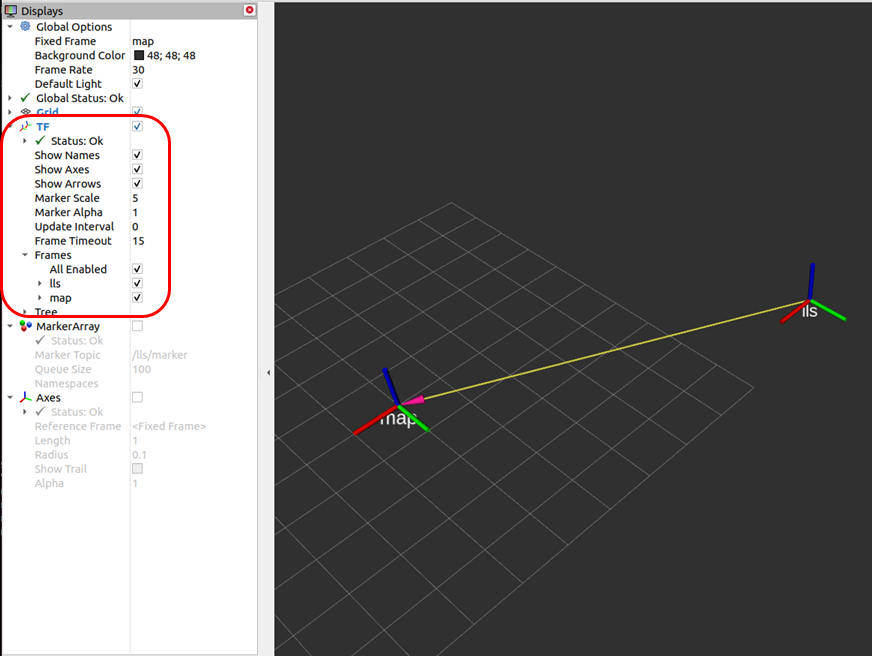

# sick_lidar_localization

ROS driver, native C++ library and REST API for SICK LiDAR localization.

## Introduction

This repository contains drivers and libraries for the API of LiDAR-LOC.
* Command API (REST)
* Streaming API (UDP)

The drivers support the following environments:

* native **without ROS** for Linux/Windows (REST and C++)
* ROS1 for Linux 
* ROS2 for Linux/Windows

## Specification

The customer requirements and the REST API specification for the implementation of the project:
[specification](doc/specifications/README.md)

## Installation
### Build on native Linux (C++ and REST API)

To build and install sick_lidar_localization on Linux without ROS, follow the steps below:

1. If not yet done, install libcurl and jsoncpp:
    ```
    sudo apt-get install libcurl-dev
    sudo apt-get install libjsoncpp-dev
    ```
2. Clone repository https://github.com/SICKAG/sick_lidar_localization:
    ```
    git clone https://github.com/SICKAG/sick_lidar_localization.git
    ```

3. Build project sick_lidar_localization with cmake:
    ```
    cd sick_lidar_localization
    if [ -d ./build ] ; then rm -rf ./build ; fi
    mkdir -p ./build
    pushd ./build
    cmake -DROS_VERSION=0 -G "Unix Makefiles" ..
    make -j4
    popd
    ```

### Build on Linux ROS 1

To build and install sick_lidar_localization on Linux using ROS 1, follow the steps below:

1. If not yet done, install libcurl and jsoncpp:
    ```
    sudo apt-get install libcurl-dev
    sudo apt-get install libjsoncpp-dev
    ```
2. Clone repository https://github.com/SICKAG/sick_lidar_localization:
    ```
    mkdir -p ./src
    pushd ./src
    git clone https://github.com/SICKAG/sick_lidar_localization.git
    popd
    ```

3. Build project sick_lidar_localization:
    ```
    source /opt/ros/noetic/setup.bash
    cp -f ./src/sick_lidar_localization/package_ros1.xml ./src/sick_lidar_localization/package.xml 
    catkin_make install --cmake-args -DROS_VERSION=1
    source ./install/setup.bash 
    ```
    For ROS versions other than noetic, please replace source `/opt/ros/noetic/setup.bash` with your ros distribution.

### Build on Linux ROS 2

To build and install sick_lidar_localization on Linux using ROS 2, follow the steps below:

1. If not yet done, install libcurl and jsoncpp:
    ```
    sudo apt-get install libcurl-dev
    sudo apt-get install libjsoncpp-dev
    ```
2. Clone repository https://github.com/SICKAG/sick_lidar_localization:
    ```
    mkdir -p ./src
    pushd ./src
    git clone https://github.com/SICKAG/sick_lidar_localization.git
    popd
    ```

3. Build project sick_lidar_localization:
    ```
    source /opt/ros/eloquent/setup.bash
    cp -f ./src/sick_lidar_localization/package_ros2.xml ./src/sick_lidar_localization/package.xml 
    colcon build --cmake-args " -DROS_VERSION=2" --event-handlers console_direct+
    source ./install/setup.bash 
    ```
    For ROS versions other than eloquent, please replace `source /opt/ros/eloquent/setup.bash` with your ros distribution.

### Build on native Windows (C++ and REST API)

To build and install sick_lidar_localization on Windows without ROS, follow the steps below:

1. If not yet done, install Visual Studio. Visual Studio 2019 Community or Professional Edition is recommended.

2. If not yet done, install the Visual Studio package manager vcpkg:
    * Download vcpkg-master.zip from https://github.com/microsoft/vcpkg/archive/master.zip and unzip to `c:\vcpkg`. Alternatively, run "git clone https://github.com/microsoft/vcpkg"
    * Install vcpkg by running the following commands:
        ```
        cd c:/vcpkg
        bootstrap-vcpkg.bat
        vcpkg integrate install
        ```
    * Include vcpkg in your path:
        ```
        set PATH=c:\vcpkg\installed\x64-windows\bin;%PATH%
        ```

3. If not yet done, install libcurl and jsoncpp using vcpkg:
    ```
    cd c:/vcpkg
    vcpkg install curl[tool]:x64-windows
    vcpkg install jsoncpp:x64-windows
    ```

4. Clone repository https://github.com/SICKAG/sick_lidar_localization:
   ```
   git clone https://github.com/SICKAG/sick_lidar_localization.git
   ```

5. Build project sick_lidar_localization with cmake and Visual Studio 2019:
   ```
   cd sick_lidar_localization
   set _os=x64
   set _cmake_string=Visual Studio 16 2019
   set _msvc=Visual Studio 2019
   set _cmake_build_dir=build
   if not exist %_cmake_build_dir% mkdir %_cmake_build_dir%
   pushd %_cmake_build_dir%
   cmake -DROS_VERSION=0 -G "%_cmake_string%" ..
   popd
   ```
   Open file `build\sick_lidar_localization.sln` in Visual Studio and build all targets (shortcut F7).

### Build on Windows ROS2 (C++ and REST API)

To build and install sick_lidar_localization on Windows with ROS-2, follow the steps below:

1. If not yet done, install Visual Studio and vcpkg (same as native Windows).

2. If not yet done, install libcurl and jsoncpp using vcpkg:
    ```
    cd c:/vcpkg
    vcpkg install curl[tool]:x64-windows
    vcpkg install jsoncpp:x64-windows
    ```

3. Clone repository https://github.com/SICKAG/sick_lidar_localization:
    ```
    git clone https://github.com/SICKAG/sick_lidar_localization.git
    ```

4. Build project sick_lidar_localization:
    ```
    copy /b/y .\src\sick_lidar_localization\package_ros2.xml .\src\sick_lidar_localization\package.xml
    colcon build --cmake-args " -DROS_VERSION=2" --event-handlers console_direct+
    call .\install\setup.bat
    ```

## Run sick_lidar_localization

Start sick_lidar_localization using the configuration file [sick_lidar_localization.launch](launch/sick_lidar_localization.launch).

The commands to start sick_lidar_localization depends on the target:

For native Linux:
```
cd ./build
./sick_lidar_localization ../launch/sick_lidar_localization.launch [options]
```

For Linux using ROS 1:
```
source ./install/setup.bash 
roslaunch sick_lidar_localization sick_lidar_localization.launch [options]
```

For Linux using ROS 2:
```
source ./install/setup.bash 
ros2 run sick_lidar_localization sick_lidar_localization ./src/sick_lidar_localization/launch/sick_lidar_localization.launch --ros-args [options]
```

For native Windows:
```
cd .\build
.\Debug\sick_lidar_localization ../launch/sick_lidar_localization.launch [options]
```

For Windows using ROS 2:
```
call .\install\setup.bat
ros2 run sick_lidar_localization sick_lidar_localization ./src/sick_lidar_localization/launch/sick_lidar_localization.launch [options]
```

### Options and configuration

Parameter can be configured in the launch file [sick_lidar_localization.launch](launch/sick_lidar_localization.launch) and overwritten by commandline arguments. 

Common parameters are:

| **parameter name** | **default value** | **parameter type** | **example** | **description** |
|--------------------|-------------------|--------------------|-------------|-----------------|
| hostname | 192.168.0.1 | string | hostname:=192.168.0.1 | IP address of the SIM localization controller |
| verbose  | 0           | int    | verbose:=1            | Print informational messages (verbose>0, otherwise error messages only) |
| udp_ip_lls_output | "" | string | udp_ip_lls_output:=192.168.0.100 | IP address of your local machine (i.e. the receiver of UDP stream messages) |
| udp_ip_lls_input | 192.168.0.1 | string | udp_ip_lls_input:=192.168.0.1 | IP address of host to send input UDP messages to, should be identical to hostname (except for unittests) |

## REST API services

LiDAR-LOC can be configured using a JSON REST API. This API is available using ROS services (on ROS 1 and ROS 2) or commandline tool `gen_service_call` (on all target systems). See [REST API services](doc/sick_localization_services.md) for details.

## <a name="cpp_api"></a> C++ API

On native Linux or Windows without ROS, tool `gen_service_call` can be used for the [REST API services](doc/sick_localization_services.md). UDP stream messages can be processed using the [C++ API](doc/cpp_api.md).

## UDP stream messages

LiDAR-LOC receives messages from and sends messages to the localization controller using UDP. UDP output messages are UDP messages sent from the localization device to the local IPC. UDP input messages are UDP messages sent from the local IPC to the localization device. On ROS 1 and ROS 2, these UDP messages are converted from respective to ROS messages. On native Linux and Windows systems, these UDP messages can be processed using the [C++ API](doc/cpp_api.md).

UDP stream output messages are:
* [Odometry messages type 1 version 4](msg/OdometryMessage0104.msg)
* [Odometry messages type 1 version 5](msg/OdometryMessage0105.msg)
* [Code measurement messages type 3 version 4](msg/CodeMeasurementMessage0304.msg)
* [Line measurement messages type 4 version 3](msg/LineMeasurementMessage0403.msg)
* [Line measurement messages type 4 version 4](msg/LineMeasurementMessage0404.msg)
* [Localization result messages type 5 version 2](msg/LocalizationControllerResultMessage0502.msg)

UDP stream input messages are:
* [Odometry messages type 1 version 4](msg/OdometryMessage0104.msg)
* [Odometry messages type 1 version 5](msg/OdometryMessage0105.msg)
* [Encoder measurement messages type 2 version 2](msg/EncoderMeasurementMessage0202.msg)
* [1D code measurement messages type 3 version 3](msg/CodeMeasurementMessage0303.msg)
* [Line measurement messages type 4 version 3](msg/LineMeasurementMessage0403.msg)
* [Line measurement messages type 4 version 4](msg/LineMeasurementMessage0404.msg)
* [2D code measurement messages type 7 version 1](msg/CodeMeasurementMessage0701.msg)

See [UDP stream messages](doc/lls_messages.md) for details and examples.

## Timestamps and time synchronization

The localization timestamps in UDP output messages are converted to system time using a Software-PLL. See [Time synchronization](doc/timing.md) and [Software-PLL](doc/software_pll.md) for details.

## System setup and source Ids

See [System setup and source Ids](doc/source_id.md) for further information about source Ids and their configuration.

## Tools and unittests

### Visualization of localization results

Localization results (i.e. the sensor position and orientation) can be visualized on ROS using lls_transform. The tool converts localization result messages and publishes the sensor pose and transform. Run lls_transform and rviz, then add display type `TF`.

ROS-1 usage example:

```
source ./install/setup.bash 
roslaunch sick_lidar_localization sick_lidar_localization.launch &
sleep 3 ; roslaunch sick_lidar_localization lls_transform.launch &
sleep 3 ; rosrun rviz rviz -d ./src/sick_lidar_localization/test/config/rviz_sick_lidar_localization_pointcloud.rviz
```

ROS-2 usage example:

```
source ./install/setup.bash 
ros2 run sick_lidar_localization sick_lidar_localization ./src/sick_lidar_localization/launch/sick_lidar_localization.launch &
sleep 3 ; ros2 run sick_lidar_localization lls_transform ./src/sick_lidar_localization/launch/lls_transform.launch &
sleep 3 ; rviz2 -d ./src/sick_lidar_localization//test/config/rviz2_sick_lidar_localization_pointcloud.rviz2
```

The following screenshot shows an example of the sensor pose:



Poses are published by ROS-transform-messages (TF) of tType geometry_msgs::TransformStamped. Each TF message has a parent and a child coordinate system identified by tf_parent_frame_id resp. tf_child_frame_id. These frame ids are configured in the launchfile, by default:
* tf_parent_frame_id: "map" 
* tf_child_frame_id: "lls"

The default frame ids for transformations should only be used as an example. In a real application, the reference to the robot is usually specified here, as it is, for example, in the ROS Nagivation stack. Here one would then use the reference
* tf_parent_frame_id: "base_link"
* tf_child_frame_id: "lls"

Frame ids are normally customized according to the application resp. setup
* tf_parent_frame_id: "map" is used by rviz by default
* tf_parent_frame_id: "base_link" is often used in examples

Other frame ids can be e.g. "robot", "vehicle" or "lidar". Choose parameter tf_parent_frame_id and tf_child_frame_id to match the target setup!

See https://roboticsknowledgebase.com/wiki/state-estimation/ros-navigation/ for further examples.

### Unittests

Folder `sick_lidar_localization/test/scripts` provide scripts for development and unittests on ROS-1, ROS-2 and native Linux or Windows. Run the following scripts for a short unittest in case of problems or use them as examples to run lidar localization:

ROS-1 Linux:
```
cd ./src/sick_lidar_localization/test/scripts
./makeall_ros1.bash
./run_linux_ros1_simu.bash
```

ROS-2 Linux:
```
cd ./src/sick_lidar_localization/test/scripts
./makeall_ros2.bash
./run_linux_ros2_simu.bash
```

Native Linux:
```
cd ./src/sick_lidar_localization/test/scripts
./makeall_linux.bash
./run_linux_simu.bash
```

Native Windows:
```
cd .\src\sick_lidar_localization\test\scripts
.\make_win64.cmd
Open sick_lidar_localization.sln in build folder and rebuild (debug version)
.\run_win64_simu.cmd
```

## FAQ, troubleshooting

### Setup

:question: How can I setup my sensor using SOPASair?

:white_check_mark: To setup and configure LiDAR-LOC with SOPASair, use of Chrome-browser under Windows is highly recommended.
See [Quickstart-Setup-SOPASair.md](doc/Quickstart-Setup-SOPASair.md) for a quickstart. 
Find detailed information in the operation manuals published on https://supportportal.sick.com/products/localization/lidar-localization/lidar-loc/ .  

### Source Ids

:question: What are source Ids and how should I configure them?

:white_check_mark: See [System setup and source Ids](doc/source_id.md) for further information about source Ids and their configuration.

### Test and diagnosis

:question: How can I activate informational messages for tests and diagnosis?

:white_check_mark: Start sick_lidar_localization with option `verbose:=1` to activate informational messages.

:question: How can I record and save localization data for offline tests and diagnosis?

:white_check_mark: Use wireshark to save udp-data from the localization server as described in [udp data recording](doc/sick_localization_recording.md)

### Error messages

:question: `ModuleNotFoundError: No module named flask` when running sick_rest_server.py

:white_check_mark: sick_rest_server.py requires python3 and flask. Install flask with `pip install flask` (on Linux, use `pip3 install flask`)

:question: `ModuleNotFoundError: No module named pcapng` when running lls_pcapng_player.py

:white_check_mark: sick_rest_server.py requires python3 with modules scapy, pypcapfile and python-pcapng. Install with `pip` (resp `pip3` on Linux):
```
pip install scapy
pip install pypcapfile
pip install python-pcapng
```
If you're still getting `ModuleNotFoundError` messages, try `sudo pip install` resp. `sudo pip3 install` instead of `pip install`.

:question: UDP messages have CRC checksum error in wireshark or tcpdump

:white_check_mark: Excerpt from https://docs.gz.ro/tuning-network-cards-on-linux.html : "If you have offload features enabled and you see chksum incorrect in tcpdump output, without any packet errors and your network is working properly: it is nothing to worry about because the checksum is actually calculated on the network adapter and the tcpdump is showing the checksum calculated on kernel level."

:question: Error MSB3491 on Windows: "Could not write lines to file. The fully qualified file name must be less than 260 characters"

:white_check_mark: Possible solutions are e.g.:
* Just clone repository https://github.com/SICKAG/sick_lidar_localization into a short path, f.e. directly to `C:\`: 
    ```
    cd c:\
    git clone https://github.com/SICKAG/sick_lidar_localization.git
    ```
    This is the recommended solution. Working on shared folder might cause errors using ROS-2 on Windows.
* Alternatively, use subst to shorten long paths, f.e.:
    ```
    subst <long_path_to_sick_lidar_localization> s:
    cd /d s:\
    ```
* Alternatively, See https://docs.ros.org/en/foxy/Guides/Installation-Troubleshooting.html:
    * Run regedit.exe, navigate to Computer\HKEY_LOCAL_MACHINE\SYSTEM\CurrentControlSet\Control\FileSystem, and set LongPathsEnabled to 0x00000001 (1).
    * Hit the windows key and type Edit Group Policy (gpedit.msc). Navigate to Local Computer Policy > Computer Configuration > Administrative Templates > System > Filesystem. Right click Enable Win32 long paths, click Edit. In the dialog, select Enabled and click OK.

:question: `rivz2` does not work on Windows

:white_check_mark: Start rviz2 with 
    ```
    call C:\dev\ros2_foxy\local_setup.bat
    call c:\opt\ros\foxy\x64\setup.bat
    call .\install\setup.bat
    ros2 run rviz2 rviz2
    ```
