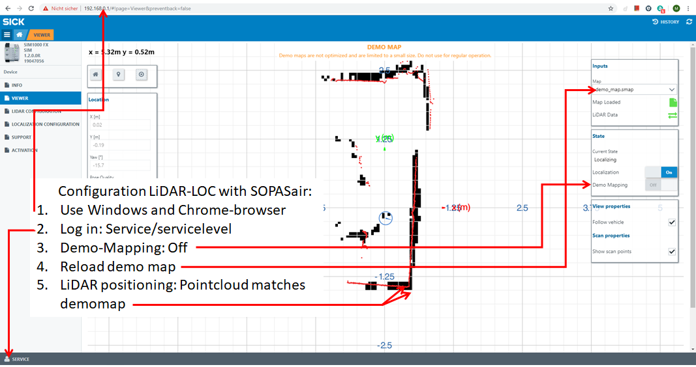

# Quickstart: LiDAR-LOC with SOPASair

SOPASair is used to setup and configure SICK LiDAR Localization. The following quickstart gives a brief overview
about setup and configuration. See the operation manuals published on https://supportportal.sick.com/products/localization/lidar-localization/lidar-loc/ -> Section Product Notes -> LiDAR-LOC Operating Instructions 
for details and further information.

## LiDAR-LOC brief setup and configuration with SOPASair

Run the following steps to setup configure your LiDAR with SIM1000FXA: 

1. Install the LiDAR-LOC software package to use SOPASair.
2. Use Windows and Chrome-browser
3. Log in with user Service and default password servicelevel
4. Switch off Demo-Mapping
5. Reload the demo map
6. Move and turn your sensor to match the pointcloud (red dots) and the demomap (black lines)

Note: Use of Chrome-browser under Windows is highly recommended for LiDAR-LOC configuration with SOPASair. 
After the initial setup under Windows, SIM1000FXA is ready to be used on ROS/Linux.
