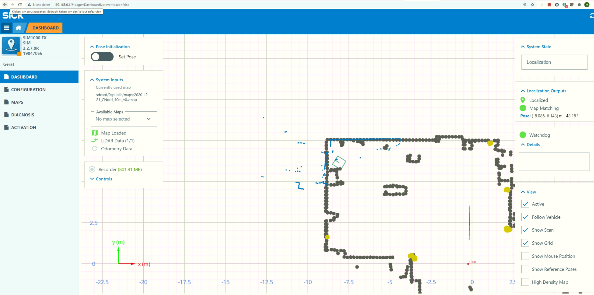
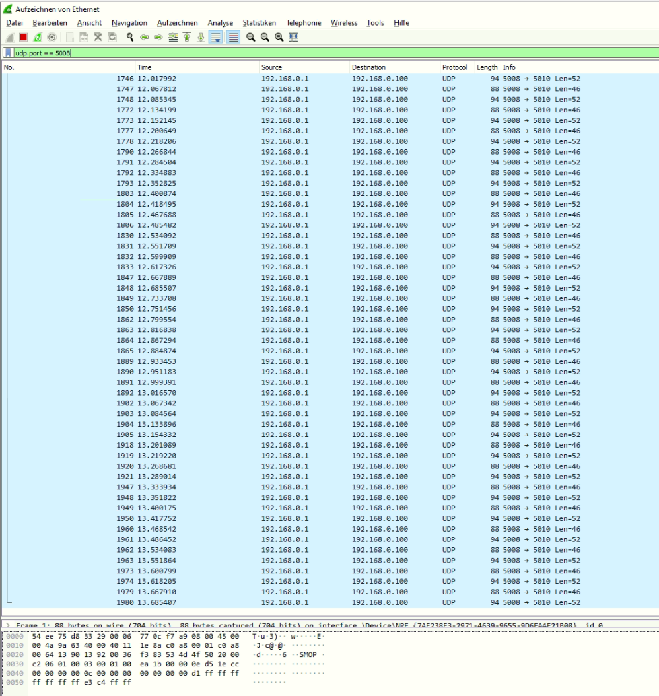
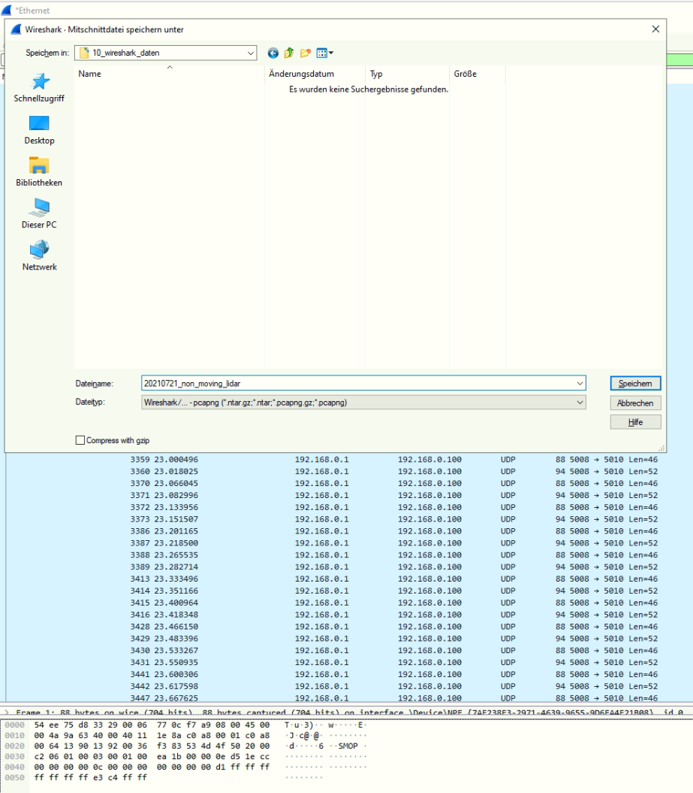

# Lidar localization UDP recording

To record support data for SICK Support refer to chapter Troubleshooting -> Support in the Operating Manual.

Use the following steps to record and save UDP data from a localization server for diagnosis:

1. Connect a Lidar to the localization server and start the system

2. Load a map to the localization server and setup the localization. The view should show the map with matching localization data and green icons for Localized, Map Matching and Watchdog:
    

3. Start wireshark with filter "udp.port==5008" (5008 is the default udp port used by the localization server to send udp localization data):
    

4. Collect data in wireshark for f.e. 15 seconds and save to a pcapng-file:
    
