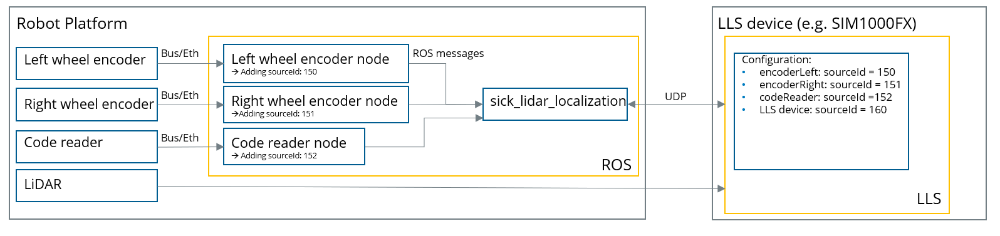
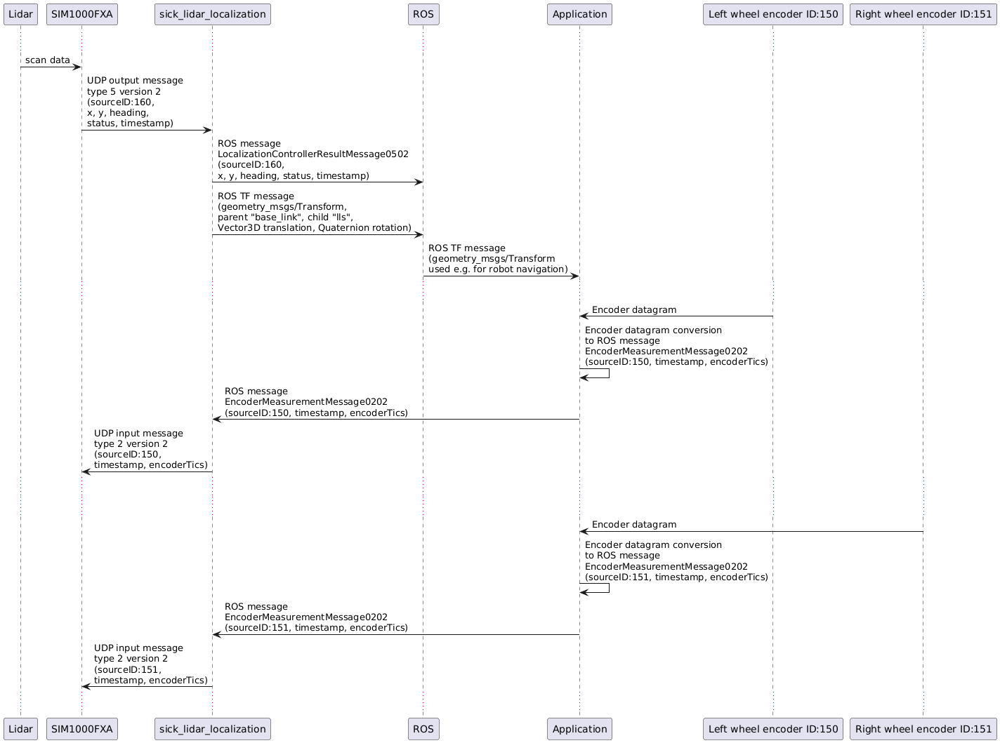
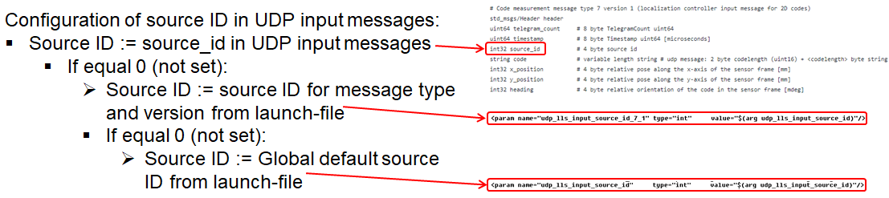
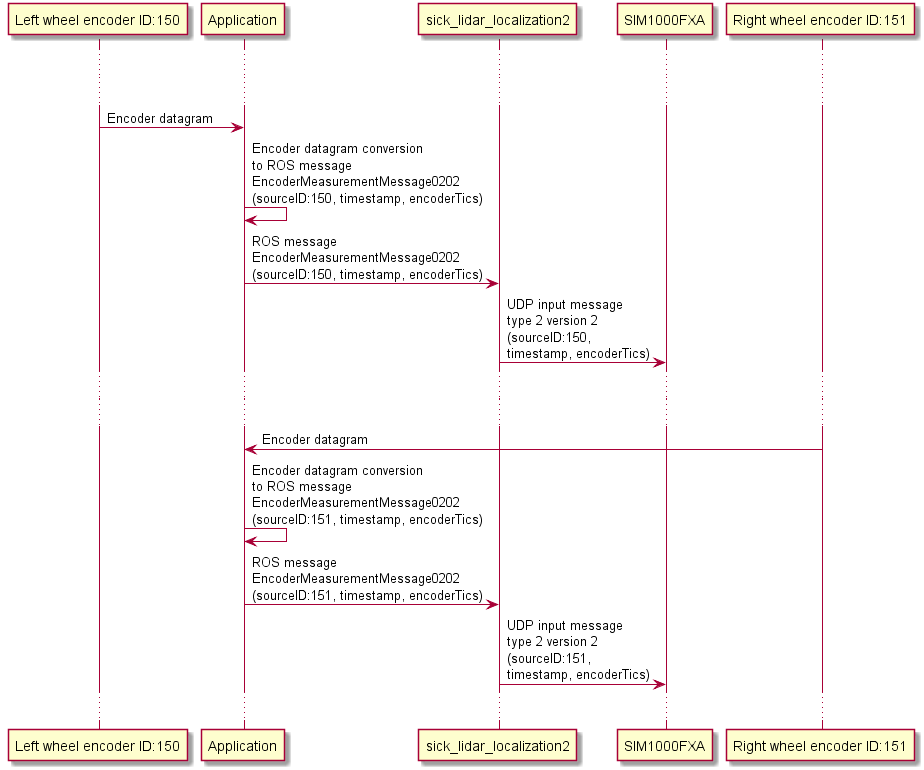
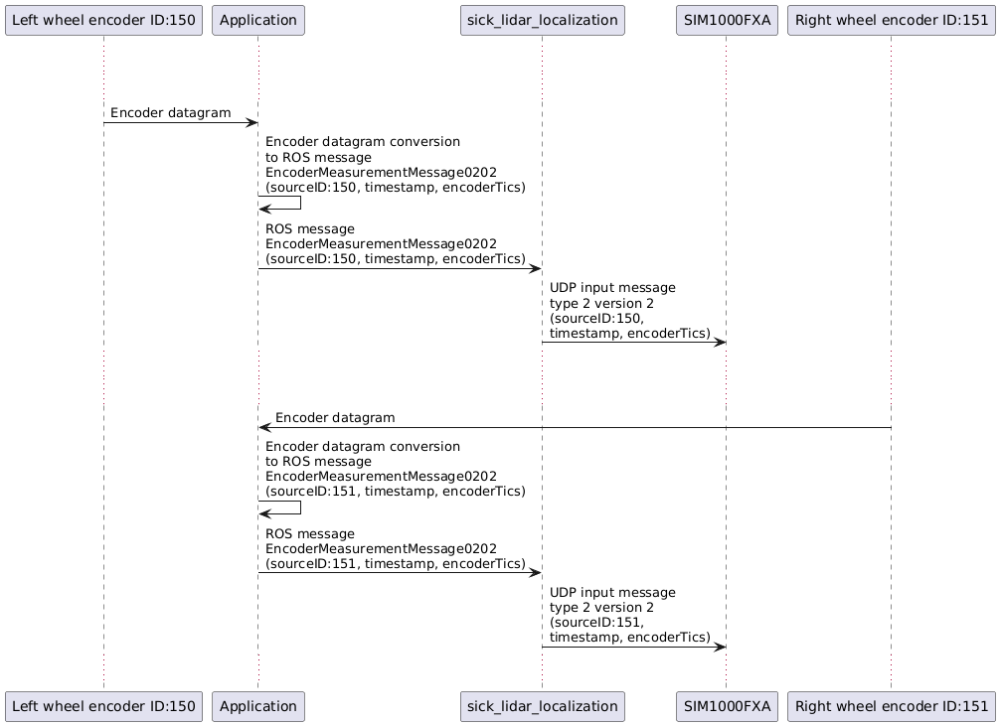
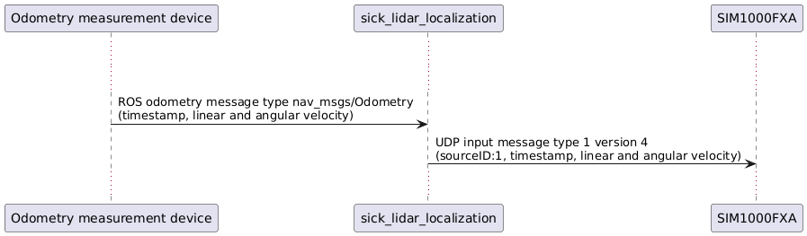
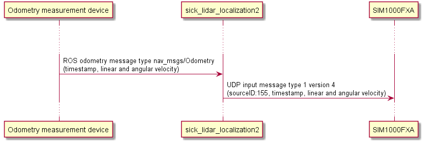

# System setup and source Ids

This chapter describes the system setup, messages and source ids.

## Background: System setup, messages and source ids

System example: A unit (e.g. robot) has multiple sensors (e.g. a lidar and 2 wheel encoders). The localization server, for example a SIM1000FX, is used for localization. The sensors communicate with the server using sick_lidar_localization2 on a target platform (e.g. ROS1 on Linux).

Communication:
* Sensors communicate with ROS messages and services with sick_lidar_localization2
* sick_lidar_localization2 communicates with SIM1000FX using UDP
* UDP input messages are sent from sick_lidar_localization2 to SIM1000FX
* UDP output messages are sent from SIM1000FX to sick_lidar_localization2
* sick_lidar_localization2 converts UDP to ROS messages and vice versa

Example:


Source Ids:
* Each sensor has a source_id (e.g. left wheel encoder: sourceId=150, right wheel encoder: sourceId=151)
* All ROS and UDP messages contain this sourceId
* All sourceIds must be configured in the SIM1000FX localization server configuration file (yml)
* SOPASair (web client) is used to down- and upload the LiDAR-LOC configuration file (yml). Modify this file to change or add sourceIds of your sensors.

Example sequence diagram:


## Configuration of source ids

The Source ID can either be 
* set individually for each UDP input message, or
* configured in launch-file for each message type and version (this works only if there is only 1 source per message type. E.g. for 2 Encoders this is not suitable).



If no source ID is set (sourceID: 0), the default source ID configured in the launch-file will be used as fallback.

### Examples

Example 1: Customized source ID configuration for 2 wheel encoders:
* Source ID of left wheel encoder: 150 (configured by customer)
* Source ID of right wheel encoder: 151 (configured by customer)
* Source ID is set individually for each wheel encoder in the ROS message
* ROS message EncoderMeasurementMessage0202 of left wheel encoder: source_id=150
   * sick_lidar_localization2 generates UDP input message type 2 version 2 with source_id=150
* ROS message EncoderMeasurementMessage0202 of right wheel encoder: source_id=151
   * sick_lidar_localization2 generates UDP input message type 2 version 2 with source_id=151



Example 2: Customized source ID configuration for 1 odometry measurement device:
* Source ID of odometry device: 155 (configured by customer)
* Source ID is set individually in the ROS message OdometryMessage0104
* ROS message OdometryMessage0104: source_id=155
   * sick_lidar_localization2 generates UDP input message type 1 version 4 with source_id=155



Example 3: Source ID configuration by launchfile for 1 odometry measurement device:
* Source ID of odometry device: 155 (configured by launchfile):
   `<param name="udp_lls_input_source_id_1_4" type="int" value="155"/>`
* Source ID = 0 (not set) in the ROS message OdometryMessage0104
* Source ID = 155 set by sick_lidar_localization2 in the UDP input message
* ROS message OdometryMessage0104: source_id=0
   * sick_lidar_localization2 generates UDP input message type 1 version 4 with source_id=155



Example 4: A robot uses standard ROS odometry messages of type [nav_msgs/Odometry](http://docs.ros.org/en/noetic/api/nav_msgs/html/msg/Odometry.html) to publish odometry data. Standard ROS odometry messages of type [nav_msgs/Odometry](http://docs.ros.org/en/noetic/api/nav_msgs/html/msg/Odometry.html) do not contain a source id. In this case, the source ID must be configured in the launchfile:
* Source ID of odometry device: 155 (configured by launchfile):
   `<param name="udp_lls_input_source_id_1_4" type="int" value="155"/>`
* A robot publishes its velocity using [ROS odometry](http://docs.ros.org/en/noetic/api/nav_msgs/html/msg/Odometry.html) messages
* sick_lidar_localization2 receives the [ROS odometry](http://docs.ros.org/en/noetic/api/nav_msgs/html/msg/Odometry.html) messages and generates UDP input message type 1 version 4 with source_id=155



Note for source id configuration by launchfile:
   * A target can be used with different localization servers with different configurations. This can simplify maintenance when source ids must be changed or adapted to different localization servers.
   * Standard ROS odometry messages of type [nav_msgs/Odometry](http://docs.ros.org/en/noetic/api/nav_msgs/html/msg/Odometry.html) do not contain a source id. ROS [nav_msgs/Odometry](http://docs.ros.org/en/noetic/api/nav_msgs/html/msg/Odometry.html) messages are supported by sick_lidar_localization2; their source id is configured in the launchfile. Depending on launchfile parameter `ros_odom_to_udp_msg`, ROS [nav_msgs/Odometry](http://docs.ros.org/en/noetic/api/nav_msgs/html/msg/Odometry.html) messages are converted to UDP input message type 1 version 4 or 5:
      * ros_odom_to_udp_msg = 1: [nav_msgs/Odometry](http://docs.ros.org/en/noetic/api/nav_msgs/html/msg/Odometry.html) messages are converted to UDP input message type 1 version 4 (source id by launchfile, linear and angular velocity by ROS message [nav_msgs/Odometry](http://docs.ros.org/en/noetic/api/nav_msgs/html/msg/Odometry.html)
      * ros_odom_to_udp_msg = 2: [nav_msgs/Odometry](http://docs.ros.org/en/noetic/api/nav_msgs/html/msg/Odometry.html) messages are converted to UDP input message type 1 version 5 (source id by launchfile, position and heading by ROS message [nav_msgs/Odometry](http://docs.ros.org/en/noetic/api/nav_msgs/html/msg/Odometry.html)
      * ros_odom_to_udp_msg = 3: [nav_msgs/Odometry](http://docs.ros.org/en/noetic/api/nav_msgs/html/msg/Odometry.html) messages are converted to both UDP input message type 1 version 4 and 5
      * Default value for ros_odom_to_udp_msg is 3 (convert to both udp message type 1, version 4 and 5):
         ```
        <arg name="ros_odom_to_udp_msg" default="3"/>          
        <!-- Convert ros odom message to udp: -->
        <!-- 1 = map velocity to OdometryPayload0104 and send udp message type 1, version 4 -->
        <!-- 2 = map position to OdometryPayload0105 and send udp message type 1, version 5 -->
        <!-- 3 = map velocity to OdometryPayload0104 and position to OdometryPayload0105 and send both udp message type 1, version 4 and 5 -->
         ```
   * A customer does not need to know details about source ids - except: "The source id used in the SIM1000FX configuration and in the launchfile must be identical"
